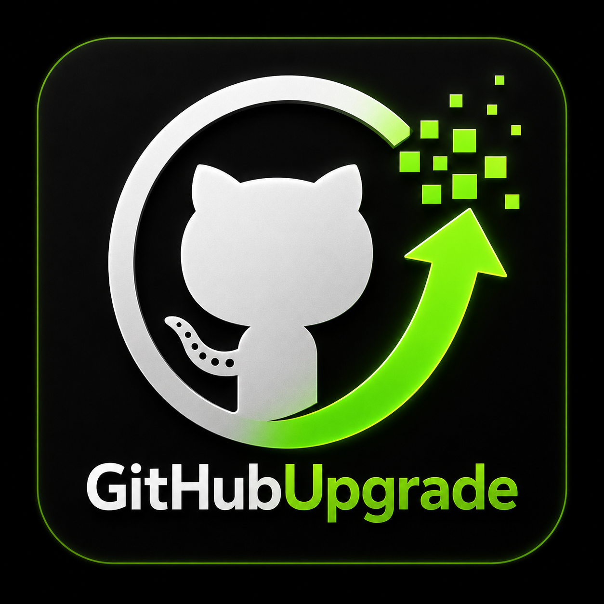

  
  
  # 🚀 GitHubUpgrade

  **Take Complete Control of Your GitHub Contribution Graph**

  
  
  
  
  
  

  *Tired of losing your GitHub streak because you worked on a private repository? Want to retroactively reflect your coding journey? GitHubUpgrade is the ultimate automation tool for curating your GitHub profile.*

  [**Get Started Now**](#-getting-started) • [**View Live App**](https://app-commit-ten.vercel.app/) • [**Join the Discussion**](https://github.com/SIMARSINGHRAYAT/APP_Commit/discussions)

  ---
  
  **Spread the Word!** Share GitHubUpgrade with your network:
   
  
  
  

 

## 🌟 Why GitHubUpgrade?

Your GitHub contribution graph is your developer resume. But sometimes, reality doesn't match the green squares. Whether you've been working on private enterprise code, taking a well-deserved break, or simply forgot to push your local commits, **GitHubUpgrade** lets you sculpt your graph exactly how you want it.

No more manual backdating, no more terminal hacks. Just a beautiful, intuitive interface to schedule, randomize, and automate your commits.

---

## 💰 Support & Monetization

If GitHubUpgrade has helped you secure a job, build your brand, or save time, please consider supporting the project! Your contributions help keep the servers running and fuel future development.

- ☕ [**Buy Me a Coffee**](https://www.buymeacoffee.com/SIMARSINGHRAYAT)
- ❤️ [**Sponsor on GitHub**](https://github.com/sponsors/SIMARSINGHRAYAT)
- 🚀 **Hire Me:** Looking for a skilled developer? Let's connect!

---

## 💬 Join the Discussion

We are building a community of developers who care about their craft! 
**[Join our GitHub Discussions](https://github.com/SIMARSINGHRAYAT/APP_Commit/discussions)** to:
- 💡 Share how you use GitHubUpgrade
- 🛠️ Request new features
- 🐛 Report bugs
- 🤝 Network with other developers

---

## ✨ Features

- **🗓️ Precision Scheduling:** Select any date range and specify exactly how many commits you want per weekday.
- **🎲 Intelligent Randomization:** Make your contribution graph look completely natural and organic with one click.
- **⚡ Zero Configuration:** No need to install complex local scripts or mess with `git rebase`. Everything runs securely via our cloud infrastructure.
- **🔒 Secure OAuth Integration:** Authenticate safely with GitHub. We request the minimum permissions needed to safely curate your commits.
- **🛡️ 100% Native Commits:** Commits are generated flawlessly using the official GitHub Git Data API, ensuring they count toward your real profile statistics.
- **✨ Browser Extension:** Access your scheduler directly from your browser, anytime, anywhere.

## 🚀 How It Works

It’s as simple as 1, 2, 3:

1. **Connect:** Securely authenticate with your GitHub account.
2. **Design:** Choose your repository, select your target dates, and set your desired commit frequency.
3. **Deploy:** Hit "Generate" and watch as our serverless backend automatically crafts and pushes the commits to your repository. GitHub will process and render them on your profile!

> **Note:** GitHub's contribution processing engine can sometimes take up to 24 hours to fully render newly generated historical commits on your public profile graph. 

## 🛠️ Built With Modern Tech

GitHubUpgrade is engineered for speed, reliability, and security:
- **Serverless Backend:** Powered by Vercel serverless functions for instant execution.
- **Direct GitHub Integration:** Utilizes the official GitHub REST API.
- **Chrome Extension Ready:** Packaged for seamless browser integration.

## 🤝 Community & Support

Love the tool? Please **give it a ⭐️ on GitHub!** It helps the project grow and reach more developers.

We believe in open-source and community-driven development. If you have ideas for new features, found a bug, or just want to say hi:
- [Open an Issue](https://github.com/SIMARSINGHRAYAT/APP_Commit/issues)
- Submit a Pull Request

## 🏷️ Tags
`#github` `#contribution-graph` `#automation` `#developer-tools` `#git` `#productivity` `#streak` `#github-api` `#vercel` `#serverless`

---

  <i>Built with ❤️ for developers who care about their craft (and their green squares).</i>

